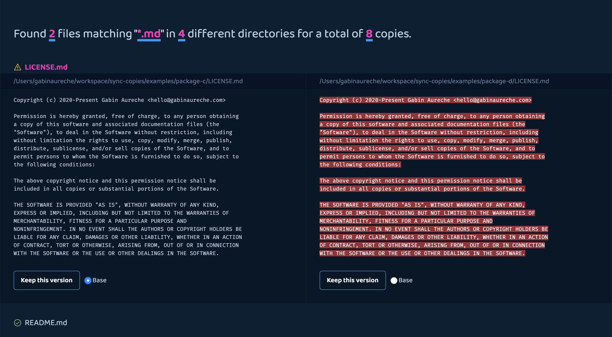

# sync-copies

Assistant to keep duplicated copies of a file identical, aka the ultimate copy/paste tool.



## Installation

```
npm install sync-copies
```

## Usage

sync-copies comes in two forms:

- [Node module](#node-module)
- [CLI](#cli)

### Node module

```js
const { serve } = require("sync-copies");
const folders = ["./packages/a", "./packages/b"];
const match = "*.md";

serve({
  folders,
  match
});
```

The above example will open a browser listing all files matching "\*.md" in the folders "./packages/a" and "./packages/b".

#### `serve(opts: { folders: string[], match: string, port?: number })`

- `folders`: the list of folders to look into.
- `match`: a glob used to match files inside the provided folders.
- `port` (optional, defaults to an available port): the port the node server should listen to.

### CLI

```
Usage
    $ sync-copies <folders>

Options
    --match, -m Files to match in the provided folders.
    --port, -p The port to listen to.
    --open, -o Open the app in the default browser.

Examples
    $ sync-copies ./packages/package-a/ ./packages/package-b/ --match '*.md'
```

The above example will open a browser listing all files matching "\*.md" in the folders "./packages/a" and "./packages/b".
